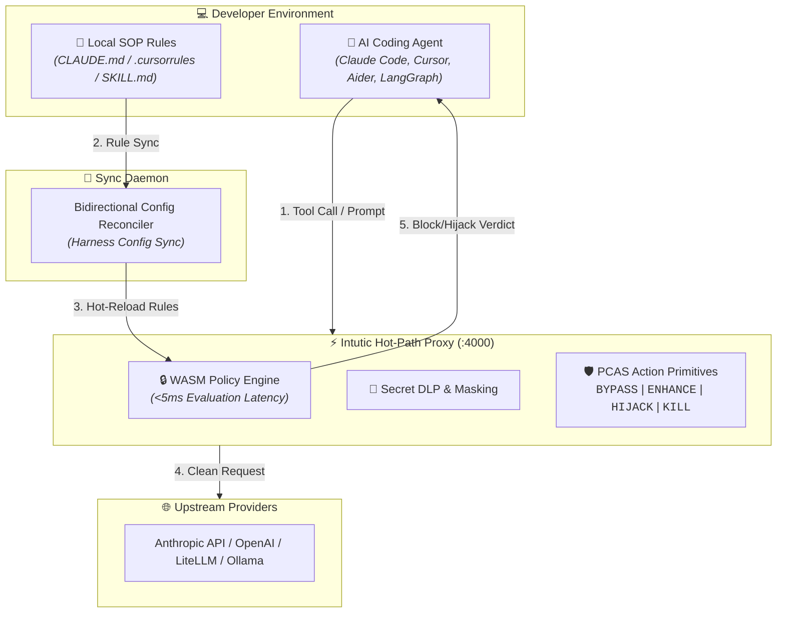

<div align="center">

# Intutic — The Circuit Breaker for AI Agents

**Real-time security, secret DLP, and loop burn prevention for autonomous AI coding agents.**

[](https://github.com/intutic/intutic)
[](https://opensource.org/licenses/MIT)
[](https://docs.intutic.ai)
[](https://github.com/intutic/intutic/actions)
[](https://github.com/intutic/intutic/pulls)

[Quickstart](#-30-second-quickstart) • [Architecture](#%EF%B8%8F-architecture) • [Key Features](#-key-features) • [Supported Harnesses](#-supported-harnesses) • [Docs](https://docs.intutic.ai)

</div>

---

## 💡 Why Intutic?

Existing AI observability tools (like LangSmith or Portkey) are **passive**. They record execution logs *after* an agent leaks a secret, deletes files, or loops into hundreds of dollars of API spend.

**Intutic is an active, low-latency circuit breaker.** It sits in the tool-call path between your AI agents and local shell/production APIs. Every tool execution passes through a sub-5ms policy evaluation chain — blocking dangerous commands before they run and steering agentic loops in real time.

---

## 🏗️ Architecture

Intutic runs as a high-performance local or self-hosted proxy (written in Rust) alongside a lightweight bidirectional config sync daemon (`sync-daemon`):



---

## ⚡ 30-Second Quickstart

### 1. Install the CLI & Native Proxy Gateway
```bash
# Install global CLI and native Rust proxy binary
npm install -g @intutic/cli @intutic/proxy

# Or run the native proxy directly on-demand
npx @intutic/proxy
```

### 2. Connect Your Workspace
Run `intutic connect` inside your project folder. This boots the local high-speed Rust proxy on port `4000` and auto-detects installed coding assistants:
```bash
intutic connect
```

### 3. Route Any Agent to Intutic
Point your favorite LLM client or agent framework to the local proxy:
```bash
export ANTHROPIC_BASE_URL="http://localhost:4000/v1"
export OPENAI_BASE_URL="http://localhost:4000/v1"
```

That's it! Your agent is now governed by real-time safety guardrails.

---

## 🔥 Key Features

| Feature | Description |
| :--- | :--- |
| ⚡ **Sub-5ms WASM Engine** | Policy evaluation overhead stays under 5ms, preserving typing speed and agent execution fluidity. |
| 🛡️ **Zero-Trust Tool Interception** | Intercepts dangerous commands (`rm -rf`, `git push --force`, `DROP TABLE`) before they touch your system. |
| 🔐 **Secret DLP & Masking** | Automatically redacts API keys (`[REDACTED_SECRET]`), AWS credentials, and tokens in prompts & tool payloads. |
| 💰 **Session Spend Ceilings** | Prevents "loop burn" by enforcing token spending ceilings per session (e.g. $5.00 limit). |
| 🔄 **18+ Harness Adapters** | Pre-configured support for Claude Code CLI, Cursor, Windsurf, Aider, Antigravity, and LangGraph. |
| 🤖 **Single & Multi-Agent Swarms** | Governs single developer tools as well as multi-agent graph workflows (LangGraph, CrewAI, AutoGen). |

---

## 🛡️ The 4 PCAS Primitives

Every tool call and prompt evaluated by Intutic produces one of four **PCAS Action Primitives**:

```
 ┌──────────┐  ┌───────────┐  ┌────────────┐  ┌──────────┐
 │  BYPASS  │  │  ENHANCE  │  │   HIJACK   │  │   KILL   │
 └────┬─────┘  └─────┬─────┘  └─────┬──────┘  └────┬─────┘
      │              │              │              │
      ▼              ▼              ▼              ▼
 Direct Pass    Inject Safety  Redact Secrets   Hard-Abort
 (<1ms Overhead) Context SOP    or Swap Args     Runaway Loop
```

1. **`BYPASS`**: Standard safe execution passes through natively (`<1ms` overhead).
2. **`ENHANCE`**: Inject contextual SOP prompt rules or architectural guidelines.
3. **`HIJACK`**: Substitute dangerous tool parameters or redact secrets on the fly.
4. **`KILL`**: Hard-abort execution thread if an agent attempts destructive file/git ops or hits loop caps.

---

## 🔌 Supported Harnesses & Frameworks

Intutic works out of the box with **18+ popular AI harnesses** without modifying your agent's source code:

| Category | Supported Tools & Frameworks |
| :--- | :--- |
| **Single-Agent Assistants** | **Claude Code CLI**, **Cursor**, **Windsurf**, **Aider**, **Antigravity**, **Cline**, **Roo Code**, **Codex**, **OpenWebUI** |
| **Multi-Agent Swarms** | **LangGraph**, **CrewAI**, **AutoGen**, **OpenHands**, **OpenClaw**, **Hermes**, **n8n** |

---

## 📝 Write Your First SOP

Intutic governance rules are written in standard Markdown files inside your repository root (`CLAUDE.md`, `.cursorrules`, or `.windsurfrules`). Intutic automatically syncs and enforces them in real time:

```markdown
# Standard Operating Procedure (SOP): Safety Guardrails

## Rules
1. **No Secret Leaks**: Agents must never output raw API keys or passwords.
2. **File Boundaries**: Restrict file modifications to the current project directory.
3. **No Force Push**: Block `git push --force` on all branches.

## Denied Commands
- `rm -rf`
- `DROP TABLE`
- `TRUNCATE`
```

---

## 💬 Interactive Slash Commands

Because Intutic evaluates prompts pre-flight, you can run interactive governance commands directly inside your agent chat:

```bash
/intutic status   # View active session spend and compliance score
/intutic rules    # List active WASM & Markdown SOP rules
```

---

## 📚 Documentation & Community

* 📖 **Developer Portal & API Reference:** [docs.intutic.ai](https://docs.intutic.ai)
* 🏗️ **Architecture & Contributor Guide:** [info.md](info.md)
* 🛠️ **WASM Rules SDK:** [`packages/wasm-sdk/`](packages/wasm-sdk/)
* 📦 **NPM Package Suite:**
  * [`@intutic/cli`](https://www.npmjs.com/package/@intutic/cli) — Developer onboarding CLI
  * [`@intutic/proxy`](https://www.npmjs.com/package/@intutic/proxy) — Native Rust proxy binary wrapper
  * [`@intutic/clawde`](https://www.npmjs.com/package/@intutic/clawde) — Programmatic TypeScript client SDK
  * [`@intutic/mcp-governance-proxy`](https://www.npmjs.com/package/@intutic/mcp-governance-proxy) — Stdio JSON-RPC MCP proxy
  * [`@intutic/shared-types`](https://www.npmjs.com/package/@intutic/shared-types) — Zod-validated shared TypeScript types

---

## ⭐ Star Us On GitHub

If you find Intutic useful, please give us a star on GitHub! It helps us support more agent harnesses and policy engines.

<div align="center">

[](https://github.com/intutic/intutic)

</div>

---

## 🏢 Enterprise & Commercial Licensing

For custom VPC deployments, enterprise-grade SSO/SAML, dedicated SLA support, or team compliance auditing, visit [intutic.ai](https://intutic.ai) or contact us at [support@intutic.ai](mailto:support@intutic.ai).

---

## 📄 License

This project is licensed under the [MIT License](LICENSE).
