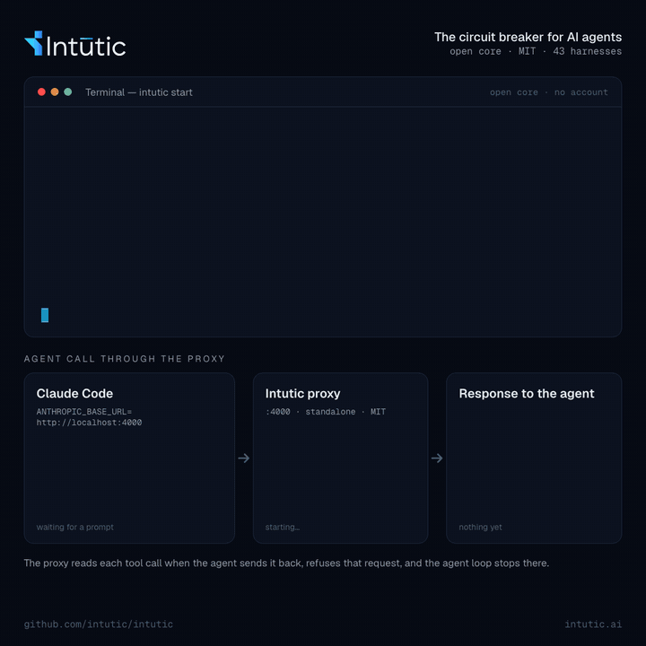
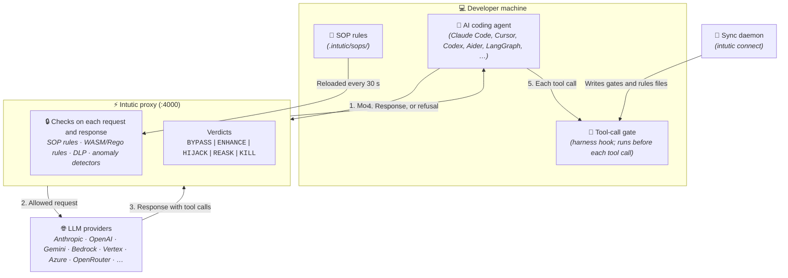

<div align="center">

# Intutic — Policy as Code for Continuous Compliance & Continuous Enforcement for AI Agents

**The circuit breaker for AI agents: your policies are files in git, enforced synchronously at the tool call, across 43 agent harnesses.**

[](https://github.com/intutic/intutic)
[](https://opensource.org/licenses/MIT)
[](https://docs.intutic.ai)
[](https://github.com/intutic/intutic/actions)
[](https://github.com/intutic/intutic/pulls)

[Quickstart](#-30-second-quickstart) • [Architecture](#%EF%B8%8F-architecture) • [Key Features](#-key-features) • [Supported Harnesses](#-supported-harnesses--frameworks) • [Docs](https://docs.intutic.ai)

<br>



</div>

---

## 💡 Why Intutic?

Observability tools and LLM gateways (like LangSmith or Portkey) work on model traffic: they trace each call, and their gateways and guardrails can cap spend, redact or reject a request inline. What they do not control is the agent's local tool execution — the shell command that deletes files, the write that leaks a secret, the loop that keeps calling an API. A gateway can stop an MCP call only when the call is routed through its own MCP gateway, as Portkey's now can.

**Intutic is an active circuit breaker at the tool call.** In 36 of the 43 supported harnesses, each tool call passes through a policy gate before it runs — a rule decision, not a model call — that blocks dangerous commands and steers agentic loops in real time. The proxies cover the rest, and the model traffic as well.

---

## 🏗️ Architecture

Intutic runs as a local or self-hosted proxy, written in Rust, between your agents and their model providers. With `intutic connect`, a sync daemon (`sync-daemon`) also installs a tool-call gate in each harness that supports one and keeps its rules files in sync:


```mermaid
flowchart TD
    subgraph Dev[" 💻 Developer machine "]
        Agent["🤖 AI coding agent<br><i>(Claude Code, Cursor, Codex, Aider, LangGraph, …)</i>"]
        SOP["📝 SOP rules<br><i>(.intutic/sops/)</i>"]
        Gate["🚦 Tool-call gate<br><i>(harness hook; runs before each tool call)</i>"]
    end

    subgraph Proxy[" ⚡ Intutic proxy (:4000) "]
        Checks["🔒 Checks on each request and response<br><i>SOP rules · WASM/Rego rules · DLP · anomaly detectors</i>"]
        Verdicts["Verdicts<br><code>BYPASS</code> | <code>ENHANCE</code> | <code>HIJACK</code> | <code>REASK</code> | <code>KILL</code>"]
    end

    Providers["🌐 LLM providers<br><i>Anthropic · OpenAI · Gemini · Bedrock · Vertex · Azure · OpenRouter · …</i>"]
    Daemon["🔄 Sync daemon<br><i>(intutic connect)</i>"]

    Agent -->|1. Model request| Proxy
    Proxy -->|2. Allowed request| Providers
    Providers -->|3. Response with tool calls| Proxy
    Proxy -->|4. Response, or refusal| Agent
    Agent -->|5. Each tool call| Gate
    SOP -->|Reloaded every 30 s| Checks
    Daemon -->|Writes gates and rules files| Gate
```

---

## ⚡ 30-Second Quickstart

### 1. Install the CLI & Native Proxy Gateway
```bash
# Install global CLI and native Rust proxy binary
npm install -g @intutic/cli @intutic/proxy

# Or run the native proxy directly on-demand
npx @intutic/proxy
```

### 2. Start the Proxy
Run `intutic start` inside your project folder. This boots the local high-speed Rust proxy on port `4000` — no account, configuration file or control plane needed:
```bash
intutic start
```

### 3. Route Any Agent to Intutic
Point your favorite LLM client or agent framework to the local proxy:
```bash
export ANTHROPIC_BASE_URL="http://localhost:4000"     # Anthropic SDKs append /v1/messages
export OPENAI_BASE_URL="http://localhost:4000/v1"      # OpenAI SDKs append /chat/completions
```

That's it! Your agent is now governed by real-time safety guardrails.

---

## 🔥 Key Features

| Feature | Description |
| :--- | :--- |
| ⚡ **In-Process WASM Engine** | Policy evaluation runs in-process — no model call and no network hop — so it adds no round-trip to the tool-call path. |
| 🛡️ **Zero-Trust Tool Interception** | Intercepts dangerous commands before they touch your system: `rm -rf` and `git push --force` are blocked at the harness hook gate; a `DROP TABLE` in an MCP tool call is blocked by the MCP governance proxy, at the hook gate it is flagged for triage rather than blocked, and the LLM proxy refuses one in a model-emitted shell command (`psql`, `mysql`, `sqlite3`, `dropdb`) whose target database is not on the workspace's DSN allowlist — opt-in, via `sql_guard:` in a SOP. |
| 🔐 **Secret DLP & Masking** | Automatically redacts API keys (`[REDACTED_SECRET]`), AWS credentials, and tokens in prompts & tool payloads. |
| 💰 **Session Spend Ceilings** | Prevents "loop burn" by enforcing token spending ceilings per session (e.g. $5.00 limit). |
| 🔄 **43 Harness Adapters** | Pre-configured support for Claude Code CLI, Cursor, Windsurf, Aider, Antigravity, OpenCode, DeepSeek dsh, Spotify Xirp, DoorDash Agentic Orchestrator, AWS Bedrock AgentCore Runtime, and more. |
| 🤖 **Single & Multi-Agent Swarms** | Governs single developer tools as well as multi-agent graph/swarm workflows — LangGraph, LangChain, CrewAI, AutoGen, AG2, Google ADK, OpenAI Agents SDK, Pydantic AI, smolagents, AWS Strands Agents, and Microsoft Agent Framework each have a dedicated SDK-side gate (Python); Mastra, the Vercel AI SDK, eve, AI SDK Harness, AI SDK Workflow, and TrueForge (embedded) have the same on the TypeScript side (`@intutic/gate`). |

---

## 🛡️ The 5 PCAS Primitives

Every tool call and prompt evaluated by Intutic produces one of five **PCAS Action Primitives**:

```
 ┌──────────┐  ┌───────────┐  ┌────────────┐  ┌──────────┐  ┌──────────┐
 │  BYPASS  │  │  ENHANCE  │  │   HIJACK   │  │  REASK   │  │   KILL   │
 └────┬─────┘  └─────┬─────┘  └─────┬──────┘  └────┬─────┘  └────┬─────┘
      │              │              │              │              │
      ▼              ▼              ▼              ▼              ▼
 Direct Pass    Inject Safety  Redact Secrets    Refuse &      Hard-Abort
 (In-Process)    Context SOP    or Swap Args    Bounded Retry  Runaway Loop
```

1. **`BYPASS`**: Standard safe execution passes through natively (in-process, no added network hop).
2. **`ENHANCE`**: Inject contextual SOP prompt rules or architectural guidelines.
3. **`HIJACK`**: Substitute dangerous tool parameters or redact secrets on the fly.
4. **`REASK`**: Refuse the attempt and hand the reason back to the agent, which may retry a bounded number of times before the finding escalates to a block.
5. **`KILL`**: Hard-abort execution thread if an agent attempts destructive file/git ops or hits loop caps.

---

## 🔌 Supported Harnesses & Frameworks

Intutic ships **43 harness adapters**: 18 install as native hook gates in the harness's own configuration, with no change to your agent's code; Claude Desktop and Roo Code have no hook system, and Continue's hooks never fire, so the three are governed through the proxy and the MCP governance proxy; 17 SDK-gated frameworks are governed by an in-process gate you add to your agent code (`@intutic/gate` or `intutic-clawde`); Aider is governed through the proxy alone; and four orchestrators and bridges hand off to an already-gated harness or an Intutic-operated bridge. Every one of them is a **supported harness** — no adapter carries an open support gap today (AutoGen's closed with its workbench gate, the Agentic Orchestrator's with OpenCode's own adapter, both in September 2026). Anything else that speaks an OpenAI- or Anthropic-compatible API is governed the same way by pointing its base URL at the proxy:

| Category | Supported Tools & Frameworks |
| :--- | :--- |
| **Single-Agent Assistants** (native adapters) | **Claude Code CLI**, **Cursor**, **Windsurf**, **Aider**, **Antigravity**, **Cline**, **Roo Code**, **Codex**, **Continue**, **Claude Desktop**, **Goose**, **Pi**, **GitHub Copilot**, **OpenWebUI**, **Muse Code**, **Grok Build**, **OpenCode**, **dsh** (preview) |
| **Multi-Agent Swarms** (native adapters) | **OpenHands**, **OpenClaw**, **Hermes**, **n8n** |
| **Orchestrators** (delegate to already-gated harnesses, no gate of their own) | **Spotify Xirp**, **DoorDash Agentic Orchestrator**, **AWS Bedrock AgentCore Runtime** (hosts your own framework-SDK code unchanged; delegates to whichever already-supported framework adapter that code uses) |
| **SDK-gated frameworks** (dedicated in-process gate, `@intutic/gate`/`intutic-clawde`) | **LangGraph**, **LangChain**, **CrewAI**, **AutoGen**, **AG2**, **Google ADK**, **OpenAI Agents SDK**, **Pydantic AI**, **smolagents**, **AWS Strands Agents**, **Microsoft Agent Framework**, **Mastra**, **Vercel AI SDK**, **eve**, **TrueForge** (embedded), **AI SDK Harness**, **AI SDK Workflow** |
| **Bridge-gated** (out-of-process Intutic-operated service, no gate in the harness's own process) | **TrueForge** (standalone/hosted server) |
| **Any OpenAI-compatible framework** (no adapter needed) | Anything else honoring `OPENAI_BASE_URL` / `ANTHROPIC_BASE_URL` — launch it with `intutic exec` or export the base-URL env vars |
| **Server-side platform integrations** (call Intutic directly over HTTP; no `HarnessType`, not auto-detected by `intutic init`) | **QM** (`securityScreen` HTTP contract), **Anthropic Managed Agents** (session-confirmation responder), **AWS Bedrock AgentCore Gateway** (interceptor Lambda) |

---

## 📝 Write Your First SOP

Intutic governance rules are written as standard Markdown files under `.intutic/sops/` in your repository, or as workspace SOPs on a connected control plane. A file can sit directly in `.intutic/sops/` (for example `.intutic/sops/safety.md`) or one folder down, one folder per rule set (for example `.intutic/sops/safety/rules.md`); the proxy and `intutic connect` read both. `intutic connect` writes them into the file each harness reads, such as `.claude/rules/intutic-governance.md`, `.cursor/rules/intutic-governance.mdc` or a marked section of `AGENTS.md` (never `CLAUDE.md`).

The front matter is what gets enforced; the prose below it is guidance the agent reads. Save this as `.intutic/sops/safety.md`:

```markdown
---
sql_guard: refuse
hook_rule: {"id": "safety.no-force-push", "tools": ["Bash"], "argContains": ["git push --force"], "reason": "Force-pushing rewrites shared history."}
hook_rule: {"id": "safety.no-recursive-delete", "tools": ["Bash"], "argContains": ["rm -rf"], "reason": "Recursive deletes need a human."}
---
# Safety Guardrails

1. **No secret leaks**: never print raw API keys or passwords.
2. **No force push**: `git push --force` is refused.
3. **No recursive deletes**: `rm -rf` is refused.
4. **No destructive SQL**: `DROP TABLE`, `TRUNCATE` and `DELETE` without `WHERE`, sent through `psql`, `mysql` or `sqlite3`, are refused.
```

The proxy refuses a `Bash` call whose arguments contain `git push --force` or `rm -rf` (each `hook_rule` matches the tool name exactly, so list the shell tool of every harness you route, such as `shell` or `run_shell_command`), and `sql_guard: refuse` refuses destructive SQL against any database not named in an `sql_allow_dsns:` line. Secret leaks are not a SOP key: the proxy's DLP scanner catches them (see [Policies › Enforcement](https://docs.intutic.ai/guide/policies#enforcement)). See [SOP Front Matter](https://docs.intutic.ai/reference/sop-front-matter) for every key.

---

## 💬 Interactive Slash Commands

Because Intutic evaluates prompts pre-flight, you can run interactive governance commands directly inside your agent chat. The proxy intercepts them before they reach the model, and a connected control plane answers them (open core alone has none, so standalone they reply that the command is unavailable):

```bash
/intutic status   # View this session's spend and compliance score
/intutic sops     # List the workspace's active SOPs
```

---

## 📚 Documentation & Community

* 📖 **Developer Portal & API Reference:** [docs.intutic.ai](https://docs.intutic.ai)
* 🏗️ **Architecture & Contributor Guide:** [info.md](info.md)
* 🛠️ **WASM Rules SDK:** [`packages/wasm-sdk/`](packages/wasm-sdk/)
* 📦 **NPM Package Suite:**
  * [`@intutic/cli`](https://www.npmjs.com/package/@intutic/cli) — Developer onboarding CLI
  * [`@intutic/proxy`](https://www.npmjs.com/package/@intutic/proxy) — Native Rust proxy binary wrapper
  * [`@intutic/clawde`](https://www.npmjs.com/package/@intutic/clawde) — Programmatic TypeScript client SDK
  * [`@intutic/gate`](https://www.npmjs.com/package/@intutic/gate) — In-process tool-call gates for SDK-gated TypeScript frameworks
  * [`@intutic/mcp-governance-proxy`](https://www.npmjs.com/package/@intutic/mcp-governance-proxy) — Stdio JSON-RPC MCP proxy
  * [`@intutic/shared-types`](https://www.npmjs.com/package/@intutic/shared-types) — Zod-validated shared TypeScript types

---

## ⭐ Star Us On GitHub

If you find Intutic useful, please give us a star on GitHub! It helps us support more agent harnesses and policy engines.

<div align="center">

[](https://github.com/intutic/intutic)

</div>

---

## 🏢 Enterprise & Commercial Licensing

For custom VPC deployments, enterprise-grade SSO/SAML, dedicated SLA support, or team compliance auditing, visit [intutic.ai](https://intutic.ai) or contact us at [support@intutic.ai](mailto:support@intutic.ai).

---

## 📄 License

This project is licensed under the [MIT License](LICENSE).
