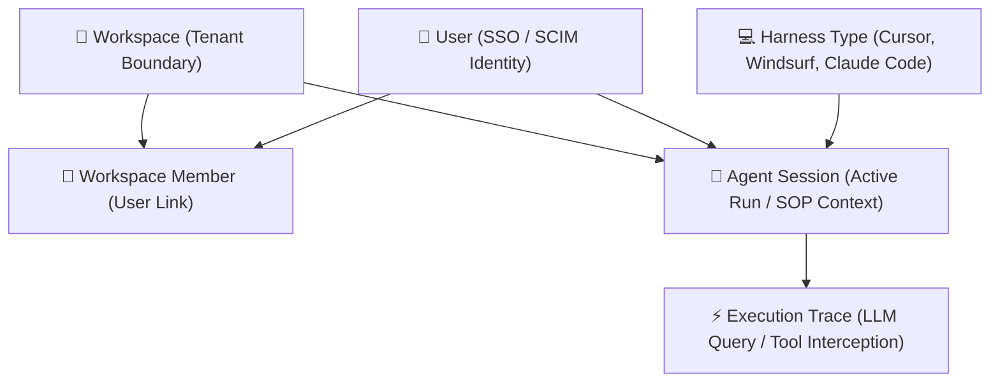

# Entity Hierarchy & Workspace Resolution <Badge type="danger" text="Enterprise" />

This page documents how the Intutic Proxy resolves the target workspace for incoming requests and the logical model hierarchy connecting organizations, developers, and agent execution logs.

---

## 1. Workspace Resolution Logic

Since the Intutic Proxy is a multi-tenant gateway, it must identify which workspace owns each intercepted LLM query in order to retrieve the correct rules, budgets, and DLP policies. 

When a request hits the Rust proxy gateway, it resolves the `workspace_id` using the following sequence:

```
                  Incoming LLM Interception Request
                                │
                                ▼
                 Check for "x-workspace-id" header?
                              /     \
                            YES      NO
                            /         \
                           ▼           ▼
             Set workspace_id from   Parse Authorization header
                 HTTP Header         (vk_{workspace_id}_{token})
                                               │
                                               ▼
                                     Extract workspace_id
```

### A. HTTP Header Inspection
The proxy checks for the presence of an explicit `x-workspace-id` HTTP header. This header is typically injected by internal CLI tools or agent portal extensions when establishing a session.

### B. Virtual Key Parsing
If the header is missing, the proxy inspects the `Authorization` bearer token. Intutic virtual keys follow a structured format:
`vk_{workspace_id}_{cryptographic_token}`

The proxy splits the token string at the delimiter to extract the `workspace_id` prefix. Once resolved, the proxy queries the Valkey cache (requesting configuration from the control plane API if missing) to retrieve policy settings for that tenant.

---

## 2. Platform Entity Hierarchy

Intutic organizes user identities, development harnesses, and agent runs in a relational hierarchy:



### 🏢 Workspace (Tenant Root)
* **Purpose**: The primary billing and security boundary. All budgets, DLP configurations, and WASM rules are defined at the workspace level.
* **Table (Enterprise Control Plane)**: `workspaces` (relational database schema)

### 👤 User & Workspace Member
* **Purpose**: The developer's physical identity (synced from SCIM/SSO). Users are mapped to one or more workspaces with specific roles (`Owner`, `Admin`, `Member`, `Auditor`) via the membership link.
* **Table (Enterprise Control Plane)**: `users` + `workspace_members`

### 💻 Harness Type
* **Purpose**: The specific client environment executing the agent (e.g., Cursor, Windsurf, Claude Code CLI, Antigravity). This is tagged on sessions to customize routing or apply harness-specific rules.

### 🤖 Agent Session
* **Purpose**: Represents an active, contiguous run of an agent session spawned by a user inside a workspace. It links to the active standard operating procedure (SOP) being enforced and isolates the budget for that run.
* **Table (Enterprise Control Plane)**: `agent_sessions`

### ⚡ Execution Trace (Leaves)
* **Purpose**: The individual actions, tool invocations, or LLM chat completions occurring within a session. The Rust proxy intercepts and evaluates rules at this level.
* **Table (Enterprise Control Plane)**: `execution_traces`

---

## 3. Multi-Developer Environments & Sync Daemon Isolation

In enterprise environments with multiple developers, Intutic maintains isolated live monitoring and centralized compliance audits through two distinct layers:

### A. Heartbeat and Telemetry Isolation (Developer Sub-Workspaces)
* The sync daemon heartbeat is cached in Valkey using the `workspace_id` (`v2:sync:heartbeat:${workspaceId}`).
* To prevent concurrent developers from overwriting each other's live session states on the **Developer Sessions** (`/agent-top`) page, each developer is provisioned their own personal sandbox or developer-specific sub-workspace ID (e.g., `wk_dev_alice`, `wk_dev_bob`).
* These sub-workspaces automatically inherit the master standard operating procedures (SOPs), DLP rules, and custom WASM filters published by SREs or platform engineers at the parent organization level (`wk_org_acme`).

### B. Centralized Audit Aggregation
* When developers run AI agent sessions (e.g., Cursor, Claude Code, Aider), the Rust proxy gateway intercepts the execution traces.
* Every trace log and incident record is database-tagged with **both** the developer's unique identity (`user_id` / `developerId`) and the shared organization `workspace_id`.
* This allows security teams, managers, and SREs to view and search consolidated logs, SLA compliance scores, and compute budgets across the entire team in the **Activity Logs** (`/traces`), **Review Queue** (`/decisions`), and **SLA Tracking** (`/sla`) views without any conflict.
