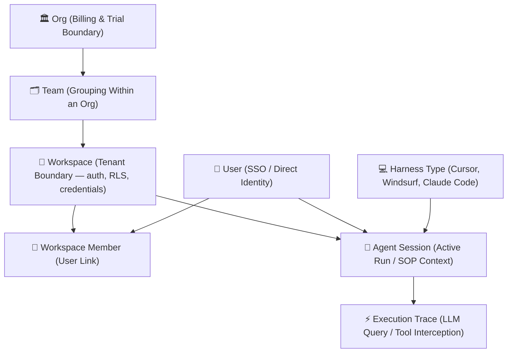

# Entity Hierarchy & Workspace Resolution <Badge type="danger" text="Enterprise" />

This page documents how the Intutic Proxy resolves the target workspace for incoming requests and the logical model hierarchy connecting organizations, developers, and agent execution logs.

---

## 1. Workspace Resolution Logic

Since the Intutic Proxy is a multi-tenant gateway, it must identify which workspace owns each intercepted LLM query in order to retrieve the correct rules, budgets, and DLP policies. 

When a request hits the Rust proxy gateway, it resolves the `workspace_id` using the following sequence:

```
                  Incoming LLM Interception Request
                                │
                                ▼
                 Check for "x-workspace-id" header?
                              /     \
                            YES      NO
                            /         \
                           ▼           ▼
             Set workspace_id from   Parse Authorization header
                 HTTP Header         (vk_{workspace_id}_{token})
                                               │
                                               ▼
                                     Extract workspace_id
```

### A. HTTP Header Inspection
The proxy checks for the presence of an explicit `x-workspace-id` HTTP header. This header is typically injected by internal CLI tools or agent portal extensions when establishing a session.

### B. Virtual Key Parsing
If the header is missing, the proxy inspects the `Authorization` bearer token. Intutic virtual keys follow a structured format:
`vk_{workspace_id}_{cryptographic_token}`

The proxy splits the token string at the delimiter to extract the `workspace_id` prefix. Once resolved, the proxy queries the Valkey cache (requesting configuration from the control plane API if missing) to retrieve policy settings for that tenant.

---

## 2. Platform Entity Hierarchy

Intutic organizes accounts, user identities, development harnesses, and agent runs in a relational hierarchy. An **org** sits above the workspace, owning billing and team structure; a **personal** signup gets an implicit org of its own so every workspace — including the very first one a solo developer creates — has the same non-nullable `org_id`/`team_id` ancestry, with no special-cased "no org" branch anywhere downstream.


```mermaid
graph TD
    Org["🏛️ Org (Billing & Trial Boundary)"]
    Team["🗂️ Team (Grouping Within an Org)"]
    Workspace["🏢 Workspace (Tenant Boundary — auth, RLS, credentials)"]
    WorkspaceMember["👥 Workspace Member (User Link)"]
    User["👤 User (SSO / Direct Identity)"]
    Harness["💻 Harness Type (Cursor, Windsurf, Claude Code)"]
    AgentSession["🤖 Agent Session (Active Run / SOP Context)"]
    ExecutionTrace["⚡ Execution Trace (LLM Query / Tool Interception)"]

    Org --> Team
    Team --> Workspace
    Workspace --> WorkspaceMember
    User --> WorkspaceMember
    Workspace --> AgentSession
    User --> AgentSession
    Harness --> AgentSession
    AgentSession --> ExecutionTrace
```

### 🏛️ Org
* **Purpose**: The billing and trial boundary. `kind: 'personal'` is the implicit org every individual signup gets — capped at exactly one team, which is the entire mechanism behind "a single user can never create more than their one default workspace." `kind: 'org'` is a real organization (`POST /api/v1/auth/signup/org`), on a paid tier with a 30-day trial from creation, capable of creating additional teams up to its plan's `maxTeamsPerOrg` limit.
* **Table**: `orgs` — `orgId`, `kind`, `planTier`, `trialExpiresAt`, `dailySpendCapUsd`, `monthlyBudgetUsd`, `stripeCustomerId`, `stripeSubscriptionId`, `ownerUserId`, `gatewayId` (nullable — see [Self-Hosted Gateway](/external/self-hosted-gateway)).
* **Authority**: `orgs.ownerUserId` is the one single-owner fact (billing/deletion authority). "Can manage this org's teams and workspaces" is derived, not a separate role: any user holding `OWNER`/`ADMIN` on *any* active workspace under the org counts (`hasOrgAdminAccess`) — there is no parallel Org-Owner/Org-Admin role split, since `WorkspaceRole`'s `OWNER`/`ADMIN` already converge everywhere a split would add.

### 🗂️ Team
* **Purpose**: Groups workspaces under an org. A personal org's one team is created automatically at signup and cannot be added to; a real org's default team is created at org signup, and admins can create more (`POST /api/v1/orgs/:orgId/teams`) up to the plan's team limit.
* **Table**: `teams` — `teamId`, `orgId` (FK, cascade), `name`, `slug`.

### 🏢 Workspace
* **Purpose**: The primary security and isolation boundary — unchanged by the org/team layer above it. All budgets, DLP configurations, WASM rules, provider credentials, and Postgres RLS policies are still keyed on `workspace_id` alone; org/team is an ancestor, not a re-scoping. Every workspace's `orgId`/`teamId` are non-nullable (denormalized onto `workspaces` so hot-path billing/auth checks need no extra join).
* **Table**: `workspaces` — gains `teamId`, `orgId`, `gatewayId` (nullable per-workspace gateway override — schema-only today, see [Self-Hosted Gateway §3](/external/self-hosted-gateway#pointing-a-workspace-at-your-gateway)).
* **Creation**: `POST /api/v1/teams/:teamId/workspaces` — the calling admin is added as the new workspace's `OWNER` (a JWT is workspace-scoped, so being an org admin elsewhere grants no automatic session on a newly created workspace). A new workspace inherits its org's current `planTier`/`dailySpendCapUsd`/`monthlyBudgetUsd` at creation time; a later org-plan change write-through updates every workspace under the org to match.

### 👤 User & Workspace Member
* **Purpose**: The developer's physical identity — provisioned directly by an admin, or created on first SSO login (SAML 2.0 or OIDC). Users are mapped to one or more workspaces with specific roles (`OWNER`, `ADMIN`, `EM`, `DEVELOPER`, `VIEWER`) via the membership link. One person can hold membership in workspaces under different orgs simultaneously — a personal signup that later joins or creates a real org keeps their original personal workspace untouched; a new `workspace_members` row under the new org links to the same `users.userId`.
* **Table**: `users` + `workspace_members`

### 💻 Harness Type
* **Purpose**: The specific client environment executing the agent (e.g., Cursor, Windsurf, Claude Code CLI, Antigravity). This is tagged on sessions to customize routing or apply harness-specific rules.

### 🤖 Agent Session
* **Purpose**: Represents an active, contiguous run of an agent session spawned by a user inside a workspace. It links to the active standard operating procedure (SOP) being enforced and isolates the budget for that run.
* **Table (Enterprise Control Plane)**: `agent_sessions`

### ⚡ Execution Trace (Leaves)
* **Purpose**: The individual actions, tool invocations, or LLM chat completions occurring within a session. The Rust proxy intercepts and evaluates rules at this level.
* **Table (Enterprise Control Plane)**: `execution_traces`

---

## 3. Multi-Developer Environments & Sync Daemon Isolation

In enterprise environments with multiple developers, Intutic maintains isolated live monitoring and centralized compliance audits through two distinct layers:

### A. Heartbeat and Telemetry Isolation (Developer Sub-Workspaces)
* The sync daemon heartbeat is cached in Valkey using the `workspace_id` (`v2:sync:heartbeat:${workspaceId}`).
* To prevent concurrent developers from overwriting each other's live session states on the **Developer Sessions** (`/agent-top`) page, each developer is provisioned their own personal sandbox or developer-specific sub-workspace ID (e.g., `wk_dev_alice`, `wk_dev_bob`).
* These sub-workspaces automatically inherit the master standard operating procedures (SOPs), DLP rules, and custom WASM filters published by SREs or platform engineers at the parent organization level (`wk_org_acme`).

### B. Centralized Audit Aggregation
* When developers run AI agent sessions (e.g., Cursor, Claude Code, Aider), the Rust proxy gateway intercepts the execution traces.
* Every trace log and incident record is database-tagged with **both** the developer's unique identity (`user_id` / `developerId`) and the shared organization `workspace_id`.
* This allows security teams, managers, and SREs to view and search consolidated logs, compliance scores, and compute budgets across the entire team in the **Activity Logs** (`/traces`), **Review Queue** (`/decisions`), and **Governance Coverage** (`/governance-coverage`) views without any conflict.
