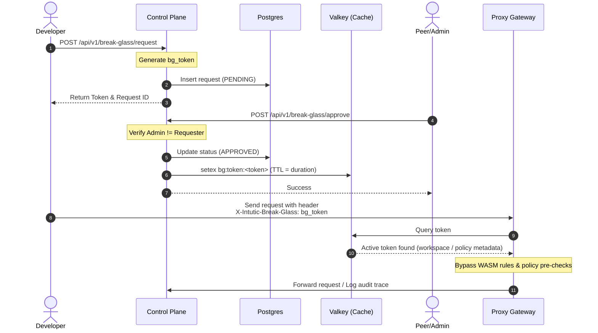

# Break-Glass Overrides <Badge type="danger" text="Enterprise" />

Temporarily bypass safety policies and custom WASM rules in emergency situations.

---

## Overview

In production environments, there are times when an agent needs to perform an action blocked by existing Standard Operating Procedures (SOPs) or security policies for urgent debugging, hotfixes, or diagnostics.

The **Break-Glass Override Workflow** provides an audited, time-limited bypass mechanism that maintains high security by requiring peer double-authorization.

---

## How It Works



---

## Requesting and Approving Overrides

### 1. Submitting a Request
Navigate to **Break-Glass** in the dashboard:
1. Enter the target **Policy ID** to bypass (or leave empty for a global bypass).
2. Choose the **Bypass Duration** (e.g. 15 minutes, 1 hour, or up to 24 hours).
3. Click **Submit Request**.
4. **Copy the Token** shown in the warning box. *For security, the token is encrypted at rest and will not be displayed again.*

### 2. Peer Approval (Double Authorization)
To prevent security gaps:
- A developer **cannot approve their own override requests**.
- Another administrator or manager must navigate to the **Break-Glass Review Queue** and click **Approve** on the request.
- Once approved, the control plane activates the token and writes it to the high-performance Valkey cache.

---

## Using the Override Token

Once the token is approved, include it as an HTTP header in requests routed through the Intutic Proxy Gateway:

```http
X-Intutic-Break-Glass: bg_xxxxxxx
```

For the configured duration, the proxy will:
1. Validate the token in Valkey (<1ms latency).
2. Skip custom WASM registry checks.
3. Skip control plane policy pre-checks.
4. Log the bypass event and associated developer in the audit trail.

---

## Security and Compliance Auditing

All break-glass activities are logged persistently:
- **Request logs:** Track who requested the override, the target policies, and the requested duration.
- **Approval logs:** Track who approved the bypass.
- **Execution logs:** Every API request executed under a break-glass token records the active token in its trace metadata.

::: warning
Bypassing compliance rules presents significant security risks. Break-glass tokens should only be used as a last resort in active incidents and must be reviewed immediately after expiration.
:::

---

## Related
- [Security & Identity](/guide/security) — SSO, API Keys, and RBAC roles
- [Settings & Configuration](/guide/settings) — Configuring control plane parameters
