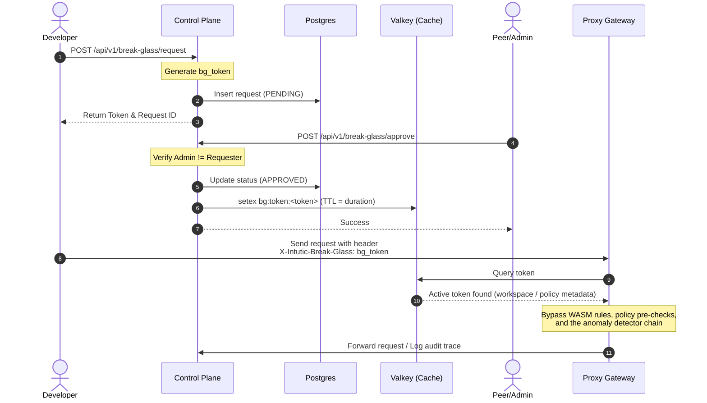

# Break-Glass Overrides <Badge type="danger" text="Enterprise" />

Temporarily bypass safety policies and custom WASM rules in emergency situations.

---

## Overview

In production environments, there are times when an agent needs to perform an action blocked by existing Standard Operating Procedures (SOPs) or security policies for urgent debugging, hotfixes, or diagnostics.

The **Break-Glass Override Workflow** provides an audited, time-limited bypass mechanism that maintains high security by requiring peer double-authorization.

---

## How It Works


```mermaid
sequenceDiagram
    autonumber
    actor Dev as Developer
    participant CP as Control Plane
    participant DB as Postgres
    participant VK as Valkey (Cache)
    actor Admin as Peer/Admin
    participant PR as Proxy Gateway

    Dev->>CP: POST /api/v1/break-glass/request
    Note over CP: Generate bg_token
    CP->>DB: Insert request (PENDING)
    CP-->>Dev: Return Token & Request ID
    
    Admin->>CP: POST /api/v1/break-glass/approve
    Note over CP: Verify Admin != Requester
    CP->>DB: Update status (APPROVED)
    CP->>VK: setex bg:token:<token> (TTL = duration)
    CP-->>Admin: Success

    Dev->>PR: Send request with header<br/>X-Intutic-Break-Glass: bg_token
    PR->>VK: Query token
    VK-->>PR: Active token found (workspace / policy metadata)
    Note over PR: Bypass WASM rules, policy pre-checks,<br/>and the anomaly detector chain
    PR->>CP: Forward request / Log audit trace
```

---

## Requesting and Approving Overrides

### 1. Submitting a Request
Navigate to **Break-Glass** in the dashboard:
1. Enter the target **Policy ID** to bypass (or leave empty for a global bypass).
2. Choose the **Bypass Duration** (e.g. 15 minutes, 1 hour, or up to 24 hours).
3. Click **Submit Request**.
4. **Copy the Token** shown in the warning box. *It is shown only this once — the control plane does not display it again after this step.* Treat it as a live credential for the whole bypass duration: it is stored as submitted, not encrypted at rest, so anyone who can read it can use it until it expires.

### 2. Peer Approval (Double Authorization)
To prevent security gaps:
- A developer **cannot approve their own override requests**.
- Another administrator or manager must navigate to the **Break-Glass Review Queue** and click **Approve** on the request.
- Once approved, the control plane activates the token and writes it to the high-performance Valkey cache.

---

## Using the Override Token

Once the token is approved, include it as an HTTP header in requests routed through the Intutic Proxy Gateway:

```http
X-Intutic-Break-Glass: bg_xxxxxxx
```

For the configured duration, the proxy will:
1. Validate the token in Valkey (a single GET).
2. Skip custom WASM registry checks.
3. Skip control plane policy pre-checks.
4. Skip the anomaly detector chain entirely — none of the twelve detector
   categories (loop detection, sequence anomalies, and the rest of the
   registry) run against a break-glass request, so no finding is recorded
   for it under any category, not just the ones a specific policy would have
   blocked.
5. Log the bypass event and associated developer in the audit trail.

---

## Security and Compliance Auditing

All break-glass activities are logged persistently:
- **Request logs:** Track who requested the override, the target policies, and the requested duration.
- **Approval logs:** Track who approved the bypass.
- **Execution logs:** Request and approval logs record who requested and approved the bypass, the target policy, and the duration. Per-request execution traces do not currently record which requests ran under a break-glass token, or the token itself — the token is never written to a trace or a log.

::: warning
Bypassing compliance rules presents significant security risks. Break-glass tokens should only be used as a last resort in active incidents and must be reviewed immediately after expiration.
:::

---

## Related
- [Security & Identity](/guide/security) — SSO, API Keys, and RBAC roles
- [Settings & Configuration](/guide/settings) — Configuring control plane parameters
