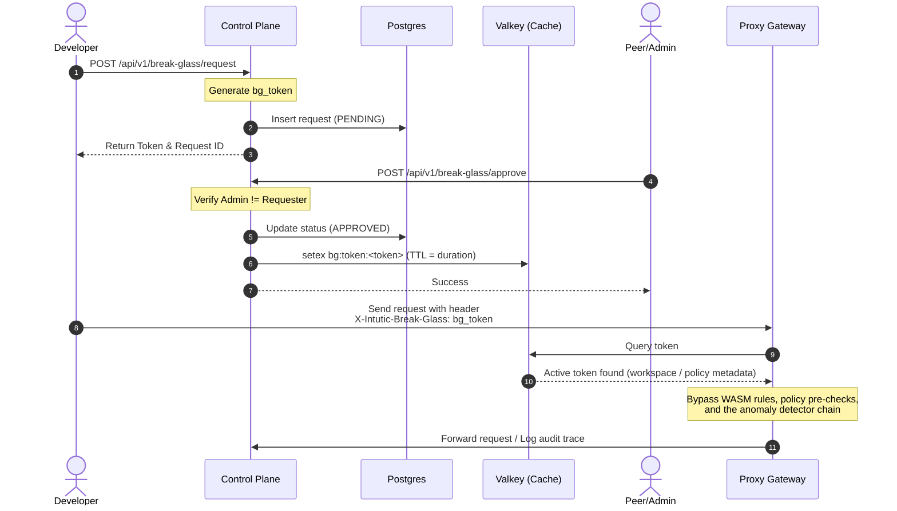

# Break-Glass Overrides <Badge type="danger" text="Enterprise" />

Temporarily bypass safety policies and custom WASM rules in emergency situations.

---

## Overview

In production environments, there are times when an agent needs to perform an action blocked by existing Standard Operating Procedures (SOPs) or security policies for urgent debugging, hotfixes, or diagnostics.

The **Break-Glass Override Workflow** provides an audited, time-limited bypass mechanism that maintains high security by requiring peer double-authorization.

---

## How It Works


```mermaid
sequenceDiagram
    autonumber
    actor Dev as Developer
    participant CP as Control Plane
    participant DB as Postgres
    participant VK as Valkey (Cache)
    actor Admin as Peer/Admin
    participant PR as Proxy Gateway

    Dev->>CP: POST /api/v1/break-glass/request
    Note over CP: Generate bg_token
    CP->>DB: Insert request (PENDING)
    CP-->>Dev: Return Token & Request ID
    
    Admin->>CP: POST /api/v1/break-glass/approve
    Note over CP: Verify Admin != Requester
    CP->>DB: Update status (APPROVED)
    CP->>VK: setex bg:token:<token> (TTL = duration)
    CP-->>Admin: Success

    Dev->>PR: Send request with header<br/>X-Intutic-Break-Glass: bg_token
    PR->>VK: Query token
    VK-->>PR: Active token found (workspace / policy metadata)
    Note over PR: Bypass WASM rules, policy pre-checks,<br/>and the anomaly detector chain
    PR->>CP: Forward request / Log audit trace
```

---

## Requesting and Approving Overrides

### 1. Submitting a Request
Navigate to **Break-Glass** in the dashboard:
1. Enter the **scope** to bypass, or leave it empty for a global bypass. A scope is `wasm:<ruleId>` (one custom WASM rule) or `detector:<detectorId>` (one anomaly detector); nothing else can be named. SOPs and hook rules have no bypass, and DLP, budgets, `deny_tools` and the control plane's pre-check are never skipped by any token.
2. Choose the **Bypass Duration** (e.g. 15 minutes, 1 hour, or up to 24 hours).
3. Click **Submit Request**.
4. **Copy the Token** shown in the warning box. *It is shown only this once — the control plane does not display it again after this step, and it is not at rest anywhere: the request row and the cache key the approval writes hold only its SHA-256.* Treat it as a live credential for the whole bypass duration: anyone holding it can use it until it expires.

### 2. Peer Approval (Double Authorization)
To prevent security gaps:
- A developer **cannot approve their own override requests**.
- Another administrator or manager must navigate to the **Break-Glass Review Queue** and click **Approve** on the request.
- Once approved, the control plane activates the token and writes it to the high-performance Valkey cache.

---

## Using the Override Token

Once the token is approved, include it as an HTTP header in requests routed through the Intutic Proxy Gateway:

```http
X-Intutic-Break-Glass: bg_xxxxxxx
```

For the configured duration, the proxy will:
1. Validate the token (a single cache GET keyed on the token's SHA-256, scoped to the workspace the approval named).
2. Mark the request's execution trace `break_glass = true` with the approval's request id, and log the bypass and the approval in the audit trail.
3. Skip what the approval's scope allows:
   - **Global** (no scope): the custom WASM rules, the control plane's policy pre-check, and the whole anomaly detector chain — none of the twelve detector categories run, so no finding is recorded under any category.
   - **`wasm:<ruleId>`**: that one WASM rule is not evaluated. Every other rule, every detector and the pre-check still run and can still block.
   - **`detector:<detectorId>`**: that detector's findings are dropped. Every other detector, every WASM rule and the pre-check still run; the corroboration count reflects the detectors that still apply.

A scoped token narrows a bypass; it never widens one. Scopes written before validation existed (an unprefixed id) are read as `wasm:<id>`.

---

## Security and Compliance Auditing

All break-glass activities are logged persistently:
- **Request logs:** Track who requested the override, the target policies, and the requested duration.
- **Approval logs:** Track who approved the bypass.
- **Execution logs:** every request served under a break-glass token is recorded on its execution trace as `break_glass = true` with the approval's request id (`break_glass_request_id`), so the traces a token covered can be listed after the fact. The token itself is never written to a trace or a log; the proxy logs the request id on success and a short hash of the token on a denial.

::: warning
Bypassing compliance rules presents significant security risks. Break-glass tokens should only be used as a last resort in active incidents and must be reviewed immediately after expiration.
:::

---

## Related
- [Security & Identity](/guide/security) — SSO, API Keys, and RBAC roles
- [Settings & Configuration](/guide/settings) — Configuring control plane parameters
